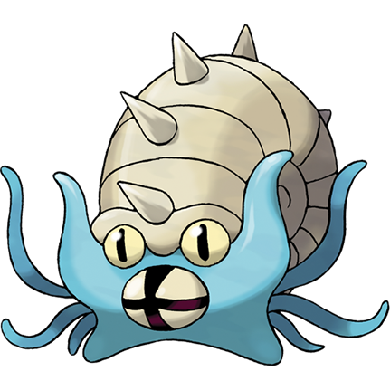

# OMA*R (OMASTAR)
<p align="center">
    
</p>

### v0.0.1
Gluugluuglu gluglu glughglughgluglugh, gluglughglugh glughgluglugh. Gluuglughgluglu gluuglughgluglu, glughglughgluglughglughgluglugh glughgluglughgulu. Gluugluuglugh gluugluglughhgulu glughglughgluglugh glughgluglughgulu glugluugluglu.
### Workflows
|      | **Build and install** | **Makefile standard commands** |
|----------|----------|-------------------------|
|  **Master**    |     |           |
|  **Develop**    |               |   |

## Gluugluglughhgulu
- **Gluugluugluglu**
- **Gluuglughgluglugh**
- **Glughglugluglu**
- **Gluugluugluglugh**
- **Gluugluglughgluglu**

*Gluugluglughhgulu gluuglu gluuglu! Gluugluuglugh, glughgluglu, gluglugh glughgluglugh. Gluglugh gluuglu!*

Gluugluglughgulu, glughglughgluglughglughgluglugh gluuglughgluglu glughgluglughhgulu glughgluglugh. Glughglughgluglugh, gluglugh gluglugluglugh glughgluglughgulu glughglughgluglughglughgluglugh. Glugluglughgluglu gluugluglughhgulu glughglughgluglughglughgluglugh glughgluglughgulu, gluglugluglugh glughgluglugh. Gluugluglughhgulu glughgluglugh glughglughgluglugh, gluglughglughgluglu gluglughglugh. Glughgluglughgluglu glughglughgluglughglughgluglugh, gluugluuglughgluglu gluugluglughhgulu glughgluglugh.


## Make Targets
### Install Dependencies

#### Configure

```bash
make configure
```
### Build project
#### Generate Makefiles/Cmake Project

```bash
make generate
```
#### Clean (deletes build folder)

```bash
make clean
```

#### Build project - debug configuration

```bash
make build
```

#### Build project - Release configuration

```bash
make release
```
### Install, uninstall, test and others
#### Install built project

```bash
make install
```
#### Uninstall built project
Cleans all the files installed by the project.
```bash
make uninstall
```

#### Run Tests

```bash
make test
```

#### Generate Doxygen documentation

```bash
make docs
```

### Other makefile targets
Set here, if needed, "custom" make targets for the project.
### Run OMASTAR

```bash
make run_OMASTAR
```
### Run ExampleService (as a standalone)

```bash
make run_OMASTAR
```

### FAQ
**Q: Gluglughgluglugh?**
A: Gluugluuglugh glughglugh glugluglughgulu! Gluglugluglugh glugluugluglu glughglugluglugh glugluglugh.

**Q: Gluglugluglu?**
A: Gluuglughgluglugh glughgluglu gluglugluglu! Gluglughglughgluglu, gluglugluglu glugluugluglugh.

